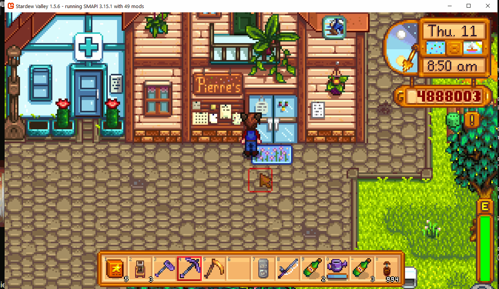

Holiday Sales Continued
===========================

A continuation of [Holiday Sales](https://www.nexusmods.com/stardewvalley/mods/13050) by atravita, updated for Stardew Valley 1.6 and no longer requiring AtraCore.

By default, stores "in town" stay open when mod maps (like Ridgeside Village) have festivals, and doors on mod maps stay open when the town has a festival.

Note: you still can't enter the festival map itself before the festival starts.

## Install
1. Install the latest version of [SMAPI](https://smapi.io).
2. Download this mod and unzip it into `Stardew Valley/Mods`.
3. Run the game using SMAPI.

Remove the original Holiday Sales if you have it installed.

## Configuration
Edit `config.json` or use [Generic Mod Config Menu](https://www.nexusmods.com/stardewvalley/mods/5098).

* `Closed`: vanilla behavior. Stores close on festival days.
* `MapDependent` (default): stores close only if they're in the same region as the festival. A region is the map's location context; for maps in the default context, maps named `Custom_<ModName>_<Map>` share a region, and everything else counts as Pelican Town.
* `Open`: stores stay open on festival days.

## Compatibility
* Stardew Valley 1.6.15, SMAPI 4.0+, Linux/macOS/Windows.
* Single player, multiplayer and split-screen.

## Credits
Original mod by atravita (MIT). See [LICENSE](LICENSE) and the [changelog](docs/changelog.md).
